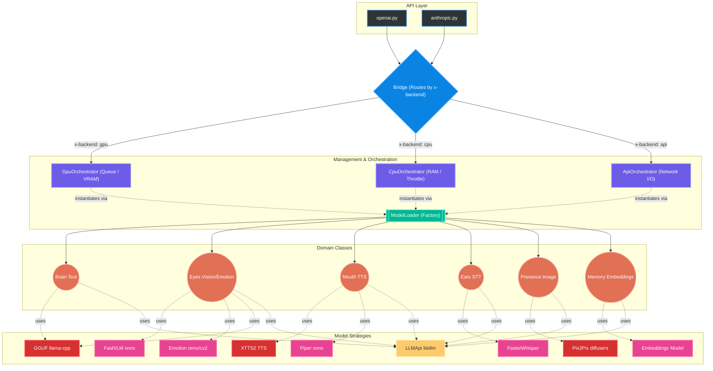

# July Engine 🚀

O **July Engine** é um motor de inferência multimodal de alta performance, projetado para operar de forma híbrida entre hardware local (CPU/GPU) e APIs externas (Ollama, OpenAI, Anthropic). Ele foi construído com foco em eficiência de recursos, sendo ideal para ambientes com VRAM limitada.

## 🏗️ Arquitetura



O sistema segue uma hierarquia de responsabilidades clara:

1.  **FastAPI (Main/Routers)**: Interface REST compatível com padrões OpenAI/Anthropic.
2.  **Bridge**: O cérebro central. Decida qual orquestrador usar com base nos headers (`x-backend`) ou carga do sistema.
3.  **Orchestrators**:
    *   `GpuOrchestrator`: Gerencia modelos carregados na VRAM. Utiliza um `ResourceManager` para evitar estouro de memória.
    *   `CpuOrchestrator`: Executa modelos via GGUF (llama-cpp) ou bibliotecas especializadas (Piper, FasterWhisper).
    *   `ApiOrchestrator`: Encaminha requisições para provedores externos via `litellm`.
4.  **Domain Classes (Brain, Eyes, Mouth, Ears, Presence, Memory)**: Abstrações de alto nível para capacidades (Texto, Visão, TTS, STT, Edição de Imagem, Embeddings).
5.  **Engine Models**: Implementações reais dos modelos (GGUF, XTTS2, Pix2Pix, etc.).

## 💾 Gerenciamento de Memória (VRAM/RAM)

Para ambientes com pouca VRAM:
-   **Auto-Unload**: O `GpuOrchestrator` monitora a VRAM via `ResourceManager`. Se um modelo pesado (como Pix2Pix) for solicitado e não houver espaço, ele descarrega modelos ociosos.
-   **GGUF Offloading**: Modelos GGUF podem ser configurados para rodar inteiramente na CPU ou ter camadas descarregadas para a GPU (`n_gpu_layers`).
-   **Singleton Loader**: O `ModelLoader` garante que apenas uma instância de cada modelo exista na memória por backend.

## 🤖 Modelos GGUF

### Como baixar e usar:
1.  Baixe modelos no formato `.gguf` (ex: do Hugging Face `TheBloke` ou `Bartowski`).
2.  Coloque-os na pasta `july_engine/models/`.
3.  Para visão, certifique-se de ter o arquivo `-mmproj.gguf` correspondente na mesma pasta.
4.  No payload, use o nome exato do arquivo: `"model": "qwen3-0.6b.gguf"`.

## 🛠️ Guia de Desenvolvimento

### Como adicionar um novo modelo:
1.  **Engine Model**: Crie uma nova classe em `jully_engine/engine_models/`. Ela deve ter métodos `load` e `run`.
2.  **Domain Mapping**: Atualize a classe de domínio correspondente (ex: `jully_engine/domain/brain.py`) para reconhecer a nova tag de modelo ou estratégia.
3.  **Orchestrator**: Se o modelo exigir inicialização especial, atualize os orquestradores.

## 🗣️ Resolução de Vozes (TTS)

O motor utiliza dois arquivos de configuração em `storage/voices/` para mapear IDs de vozes para arquivos reais:
1.  `voices.json`: Vozes padrão do sistema.
2.  `uploaded_voices.json`: Vozes carregadas dinamicamente pelos usuários.

### Abstrações por Modelo:
-   **XTTS2**: Utiliza o campo `"path"`. Deve apontar para um arquivo `.wav` de referência (ex: `yuni.wav`) dentro da pasta de vozes. O modelo usa esse áudio para clonagem de voz (Zero-Shot).
-   **Piper**: Utiliza o campo `"piper_path"`. Deve seguir a estrutura do repositório `rhasspy/piper-voices` (ex: `pt/pt_BR/yuni/medium/pt_BR-yuni-medium.onnx`). Se o arquivo não existir localmente, o motor tentará baixá-lo automaticamente do Hugging Face.

Exemplo de entrada no JSON:
```json
{
    "id": "yuni",
    "language": "pt",
    "path": "yuni.wav",
    "piper_path": "pt/pt_BR/yuni/medium/pt_BR-yuni-medium.onnx"
}
```

### Como usar na Requisição:
No endpoint `POST /v1/openai/audio/speech`, o campo `voice` deve conter o `id` da voz desejada.

**Exemplo de Payload:**
```json
{
    "model": "xtts",
    "input": "Olá, eu sou a Yuni!",
    "voice": "yuni"
}
```

O motor buscará o ID `"yuni"` nos arquivos JSON e resolverá os caminhos correspondentes para o modelo solicitado (`xtts` ou `piper`).

## 📡 Endpoints e Headers Customizados

### Headers Críticos:
-   `x-backend`: `cpu`, `gpu` ou `api`. Define onde o processamento ocorrerá.
-   `x-base-url`: URL base para provedores de API (usado no backend `api`).

### Endpoints Principais:
-   `POST /v1/openai/chat/completions`: Chat e Visão.
-   `POST /v1/openai/embeddings`: Geração de vetores.
-   `POST /v1/openai/audio/speech`: TTS (XTTS2, Piper).
-   `POST /v1/openai/audio/transcriptions`: STT (FasterWhisper).
-   `POST /v1/openai/images/generations`: Geração de imagem.
-   `POST /v1/openai/images/edits`: Edição via Pix2Pix.
-   `GET /health`: Status do motor e uso de hardware.

## 🧪 Testes de Integração
Rode a suíte completa para garantir que nada quebrou:
```bash
pytest july_engine/tests/test_integration.py -v -s
```
Flags úteis: `--cpu-only`, `--gpu-only`, `--api-only`.
