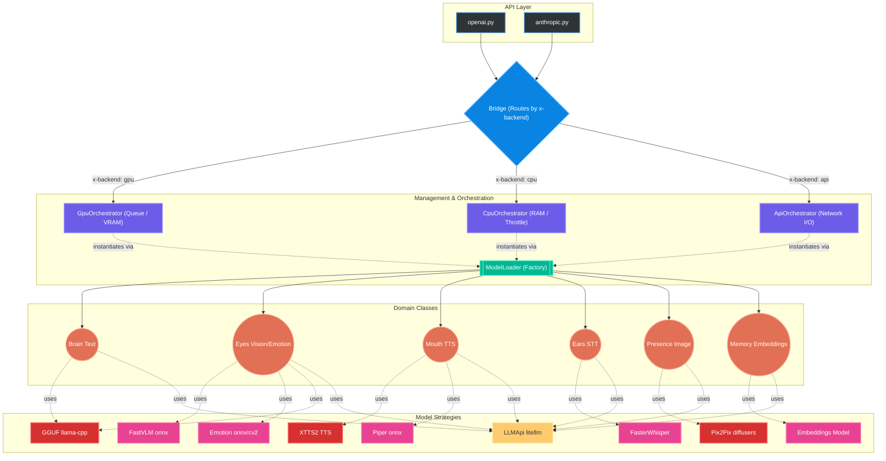

# July Engine

**July Engine** is a high-performance multimodal inference engine
, designed to operate hybridly between local hardware (CPU/GPU) and external APIs (Ollama, OpenAI, Anthropic). It was built with a focus on resource efficiency, making it ideal for environments with limited VRAM.

## 🏗️ Architecture



The system follows a clear hierarchy of responsibilities:

1.  **FastAPI (Main/Routers)**: REST interface compatible with OpenAI/Anthropic standards.
2.  **Bridge**: The central brain. Decides which orchestrator to use based on headers (`x-backend`) or system load.
3.  **Orchestrators**:
    *   `GpuOrchestrator`: Manages models loaded in VRAM. Uses a `ResourceManager` to prevent memory overflow.
    *   `CpuOrchestrator`: Runs models via GGUF (llama-cpp) or specialized libraries (Piper, FasterWhisper).
    *   `ApiOrchestrator`: Forwards requests to external providers via `litellm`.
4.  **Domain Classes (Brain, Eyes, Mouth, Ears, Presence, Memory)**: High-level abstractions for capabilities (Text, Vision, TTS, STT, Image Editing, Embeddings).
5.  **Engine Models**: Real implementations of models (GGUF, XTTS2, Pix2Pix, etc.).

## 💾 Memory Management (VRAM/RAM)

For environments with low VRAM:
-   **Auto-Unload**: The `GpuOrchestrator` monitors VRAM via `ResourceManager`. If a heavy model (like Pix2Pix) is requested and there is no space, it unloads idle models.
-   **GGUF Offloading**: GGUF models can be configured to run entirely on the CPU or have layers offloaded to the GPU (`n_gpu_layers`).
-   **Singleton Loader**: The `ModelLoader` ensures that only one instance of each model exists in memory per backend.

## 🤖 GGUF Models

### How to download and use:
1.  Download models in `.gguf` format (e.g., from Hugging Face `TheBloke` or `Bartowski`).
2.  Place them in the `july_engine/models/` folder.
3.  For vision, make sure you have the corresponding `-mmproj.gguf` file in the same folder.
4.  In the payload, use the exact file name: `"model": "qwen3-0.6b.gguf"`.

## 🛠️ Development Guide

### How to add a new model:
1.  **Engine Model**: Create a new class in `july_engine/engine_models/`. It must have `load` and `run` methods.
2.  **Domain Mapping**: Update the corresponding domain class (e.g., `july_engine/domain/brain.py`) to recognize the new model tag or strategy.
3.  **Orchestrator**: If the model requires special initialization, update the orchestrators.

## 🗣️ Voice Resolution (TTS)

The engine uses two configuration files in `storage/voices/` to map voice IDs to real files:
1.  `voices.json`: Default system voices.
2.  `uploaded_voices.json`: Voices dynamically uploaded by users.

### Abstractions per Model:
-   **XTTS2**: Uses the `"path"` field. Must point to a reference `.wav` file (e.g., `yuni.wav`) within the voices folder. The model uses this audio for voice cloning (Zero-Shot).
-   **Piper**: Uses the `"piper_path"` field. Must follow the `rhasspy/piper-voices` repository structure (e.g., `pt/pt_BR/yuni/medium/pt_BR-yuni-medium.onnx`). If the file does not exist locally, the engine will attempt to download it automatically from Hugging Face.

Example JSON entry:
```json
{
    "id": "yuni",
    "language": "pt",
    "path": "yuni.wav",
    "piper_path": "pt/pt_BR/yuni/medium/pt_BR-yuni-medium.onnx"
}
```

### How to use in the Request:
In the `POST /v1/openai/audio/speech` endpoint, the `voice` field must contain the `id` of the desired voice.

**Example Payload:**
```json
{
    "model": "xtts",
    "input": "Hello, I am Yuni!",
    "voice": "yuni"
}
```

The engine will search for the ID `"yuni"` in the JSON files and resolve the corresponding paths for the requested model (`xtts` or `piper`).

## 📡 Custom Endpoints and Headers

### Critical Headers:
-   `x-backend`: `cpu`, `gpu`, or `api`. Defines where the processing will occur.
-   `x-base-url`: Base URL for API providers (used in the `api` backend).

### Main Endpoints:
-   `POST /v1/openai/chat/completions`: Chat and Vision.
-   `POST /v1/openai/embeddings`: Vector generation.
-   `POST /v1/openai/audio/speech`: TTS (XTTS2, Piper).
-   `POST /v1/openai/audio/transcriptions`: STT (FasterWhisper).
-   `POST /v1/openai/images/generations`: Image generation.
-   `POST /v1/openai/images/edits`: Editing via Pix2Pix.
-   `GET /health`: Engine status and hardware usage.

## 🧪 Integration Tests
Run the full suite to ensure nothing is broken:
```bash
pytest july_engine/tests/test_integration.py -v -s
```
Useful flags: `--cpu-only`, `--gpu-only`, `--api-only`.
