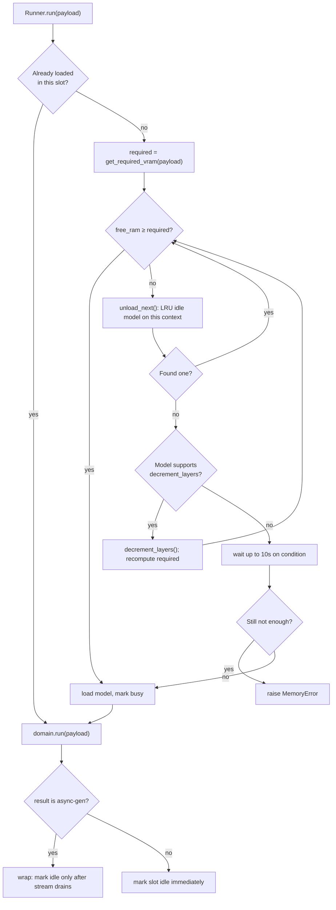

---
tags:
  - Architecture
  - VRAM
---

# Orchestrator & VRAM Management

**File:** `app/orchestrator.py`

One `Orchestrator` singleton holds exactly two shared context objects — `GpuContext` and `CpuContext` — so model "loaded/idle/busy" state is consistent across every request on that backend, **regardless of which model**. This is the load-bearing design decision in this file: without a shared singleton per backend, every request would construct a fresh context with empty state, `is_loaded()` would always return `False`, and a model would try to reload itself while still occupying the VRAM its previous instance never freed.

## BaseContext / GpuContext / CpuContext

`BaseContext` tracks per-model "slot" state in a plain dict (`self.state[slot_name] = {"status": "idle"|"busy", "usage_count": int, "runner": Runner, "last_used": timestamp}`), guarded by a `threading.Lock` (state is touched from both async code and `asyncio.to_thread` workers) plus an `asyncio.Condition` used to wake up requests that are waiting on freed resources. `GpuContext.get_free_ram()` reads `resource_manager.get_available_vram_mb()`; `CpuContext.get_free_ram()` reads `get_available_ram_mb()`.

Each context also lazily creates one `ReentrantModelLock` per model alias (`get_model_lock`), keyed off the ambient `request_id_var` context variable — this lets the **same request** re-enter a lock it already holds (e.g. a tool-calling loop that calls back into the same model) without deadlocking, while still serializing genuinely concurrent requests against the same model.

## Runner — the per-request resource dance

`Runner.__init__` resolves the model instance via `model_loader.get(task_type, backend, model_tag)` and either uses the pre-selected context (from an explicit `x-backend` header) or derives one from the model's own resolved backend.

`Runner.run(payload)` does, in order, under the model's `ReentrantModelLock` and then the context's `orchestrator_lock`:

1. `context.garbage_collection()` — calls `resource_manager.clear_memory()` opportunistically.
2. If the model isn't already loaded in this slot, compute `required = await domain.get_required_vram(payload)`.
3. **While** `context.get_free_ram() < required`:
   1. Try `unload_next(required)` — finds the least-recently-used **idle** model slot on this same context (excluding the one about to be loaded) and unloads it.
   2. If nothing was evictable and the model supports `decrement_layers()` (GGUF only), call it — this progressively pushes GPU layers to CPU one at a time, then re-checks `required` against the now-smaller footprint.
   3. If the model doesn't support layer decrement (e.g. a diffusers pipeline like Flux), or layers are already at 0, wait up to 10s on the context's condition variable for something else to free up resources.
   4. If still insufficient after that wait, raise `MemoryError` with the required/available MB in the message.
4. Load the model (`asyncio.to_thread(domain.load)`) if not already loaded, and mark the slot busy.
5. Run `domain.run(payload)` **outside** the lock (so slow inference doesn't block other models' resource accounting), then mark the slot idle again in a `finally` block — **the model stays warm in VRAM**; it's only evicted later by another request's `unload_next()`, or via an explicit `DELETE /v1/models/{alias}` (`Orchestrator.unload_model`).

## VRAM estimation

`get_required_vram(payload)` is implemented per-model (see [Models](../models/index.md) — most non-GGUF models return a hardcoded constant; GGUF chat models call the shared [resource calculator](../configuration/resource-calculator.md), which accounts for context window, KV cache quantization, mmproj (vision) size, and — as of the `cpu_moe`/`n_cpu_moe` options — Mixture-of-Experts weight offloading).

## Unloading a model explicitly

`Orchestrator.unload_model(model_alias)` (backing `DELETE /v1/models/{alias}`) walks every slot on the context that last served that alias, calls `runner.unload()` on each matching one, removes it from `context.state`, and evicts the cached adapter instance from `model_loader.instances` via `model_loader.delete_instance(backend, model_alias)` — so the next request for that alias builds a fresh adapter/model instance from current settings rather than reusing stale state.
