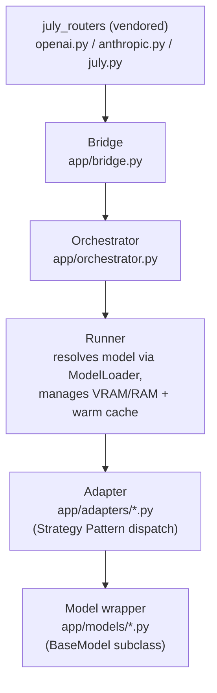

---
tags:
  - Architecture
---

# Architecture Overview

July Engine (`july_engine`) is the local inference core of the "Jully" ecosystem: a FastAPI multimodal engine serving chat (OpenAI/Anthropic-compatible), vision, TTS/STT, image generation/editing, entity extraction, and RAG — entirely with local models. It auto-manages VRAM/RAM: loading models, keeping them warm, LRU-evicting under pressure, and decrementing GPU layers as a last resort before refusing a request.

External web/code search used to live in this repo but moved to a separate **July Search** service — July Engine no longer calls external LLM APIs in its normal request path. See [Known Issues & Dead Paths](../known-issues.md) for the leftover code from that transition.

## Layered request flow

Each layer has one job:

| Layer | File(s) | Responsibility |
|---|---|---|
| Routers | `vendor/july_engine_libs` (`july_routers`) | HTTP surface — OpenAI/Anthropic/native schemas. Call `bridge.process_*` only, never the orchestrator directly. |
| Bridge | `app/bridge.py` | "Dumb" routing: injects headers, maps `task_type` → settings key, dispatches to the orchestrator. No domain logic. |
| Orchestrator | `app/orchestrator.py` | VRAM/RAM accounting, warm-model cache, LRU eviction, GPU-layer decrement — generic over every task type. |
| ModelLoader | `app/model_loader.py` | Resolves which `Adapter` class handles a `task_type`, caches adapter instances. |
| Adapters | `app/adapters/*.py` | One per task family; the real Strategy Pattern layer — resolves the concrete model wrapper from an alias/tag. |
| Models | `app/models/*.py` | Concrete low-level wrapper around the actual inference library (`llama-cpp-python`, `diffusers`, `transformers`, ONNX, ...). See the [Models](../models/index.md) section. |

## Design patterns in play

- **Bridge Pattern** — `app/bridge.py`'s `Bridge` routes without any knowledge of *how* a task is actually served.
- **Adapter / Strategy Pattern** — each `app/adapters/*.py` picks a concrete model implementation based on an alias/tag at request time, so swapping e.g. Kokoro for Chatterbox is a settings change, not a code change.
- **Orchestrator Pattern** — `app/orchestrator.py`'s `Orchestrator`/`Runner`/`BaseContext` trio owns all resource-management concerns generically, so no adapter or model ever has to reason about VRAM itself.
- **Service Locator** — `app/model_loader.py`'s `ModelLoader` lazily imports and caches adapter classes/instances by `f"{task_type}_{backend}_{model_tag}"`.

## Two independent config/storage layers

Don't confuse these — they're selected by different env vars and serve different data:

- **Settings & model catalog** — `PERSISTENCE_BACKEND` (`tinydb` default, or `postgres`). Holds task settings, the GGUF model catalog, uploaded voices, MCPs, history events.
- **RAG vector store** — `RAG_DATABASE` (`chroma` / `pgvector` / `in-memory`). Holds embeddings only.

See [Persistence & Vector Store](persistence.md) for details.

## Next

- [Request Flow](request-flow.md) — a concrete request traced end-to-end.
- [Orchestrator & VRAM Management](orchestrator.md) — how warm-model caching, LRU eviction, and layer decrement actually work.
- [Models](../models/index.md) — every concrete model wrapper, one page each.
