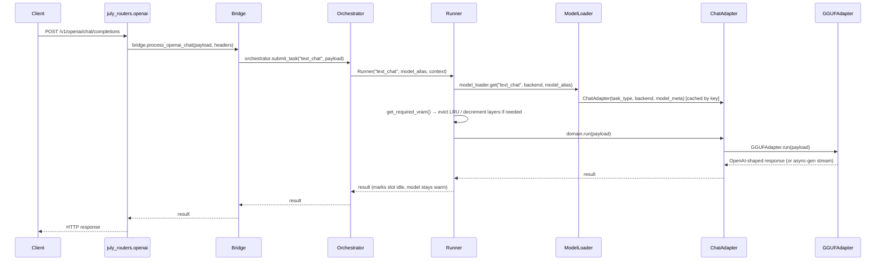

---
tags:
  - Architecture
---

# Request Flow

A concrete trace of `POST /v1/openai/chat/completions` from HTTP request to model output — every other endpoint follows the same shape with a different `task_type`.

## Step by step

1. **Router** (`july_routers.openai.router`, vendored) parses the OpenAI-schema request body and calls `bridge.process_openai_chat(payload, headers)`. Routers never talk to the orchestrator or any adapter directly — `main.py` wires each router module via its own `set_bridge(bridge)` call at startup.
2. **Bridge** (`app/bridge.py`) injects `headers` into the payload (`_inject_headers`) and calls `orchestrator.submit_task("text_chat", payload)`. This is the *only* thing `Bridge` does — no model resolution, no VRAM logic.
3. **Orchestrator.submit_task** reads `payload["headers"]["x-backend"]` (`cpu`/`gpu`) to pre-select a shared `BaseContext` singleton if present, then constructs a `Runner(task_type, model_alias, context)`. If `x-backend` is absent, the `Runner` will derive the backend from the resolved model's own settings instead.
4. **Runner.__init__** calls `model_loader.get("text_chat", backend, model_alias)`, which resolves `task_type` → `ChatAdapter` (via `_ADAPTER_REGISTRY`) and either returns a cached adapter instance (keyed by `f"{task_type}_{resolved_backend}_{model_tag}"`) or constructs a new one from the matching settings entry.
5. **Runner.run** does the resource dance (see [Orchestrator & VRAM Management](orchestrator.md) for the full detail): compute required VRAM/RAM if not already loaded, evict the LRU idle model on the same backend context if there's not enough room, decrement GPU layers as a last resort, then `await domain.load()` if needed and mark the slot busy.
6. **ChatAdapter.run** (`app/adapters/chat_adapter.py`) resolves its one strategy — `GGUFAdapter` — and delegates. (Vision/tool-call preprocessing, when relevant, happens here before the model call.)
7. **GGUFAdapter.run** (`app/models/gguf_adapter.py`) delegates to the vendored `llama_gguf.GGUF.run_chat(...)`, which does the actual llama.cpp inference, KV-cache sequence handling, and tool-calling/reasoning logic.
8. **Runner.run**'s `finally` block marks the slot idle again once the call returns (or, for a streaming response, once the async generator is fully consumed) — **the model itself stays loaded in VRAM**. It's only unloaded later to make room for something else, or via an explicit `DELETE /v1/models/{alias}`.

## Where a video/streaming request differs

For task types whose model `run()` returns an async generator (video generation, some TTS engines with `stream=True`) — `Runner.run` detects `hasattr(result, '__aiter__')` and wraps it in a `generator_wrapper` that marks the slot idle only once the stream is fully drained, instead of immediately after the call returns. This is what lets [Wan2.2](../models/wan2_t2v.md)/[LTX-2](../models/ltx2_video.md) stream a rendered video back to the client in chunks without holding the whole clip in memory — see [SDNQ Diffusion Base](../models/sdnq_diffusion_base.md) for the model-side half of this contract.

## Headers that change routing

| Header | Effect |
|---|---|
| `x-backend: cpu\|gpu` | Pre-selects the shared context in `Orchestrator.submit_task`; if omitted, the backend is derived from the resolved model's own settings. |
| `x-context-window` | Per-request context-window override, read inside the vendored `GGUF.get_required_vram`/`run_chat`. |
| `x-session-id` | KV-cache sequence-slot affinity across turns of the same conversation/agentic loop (handled in the vendored `llama_gguf` package, not in `app/`). |
