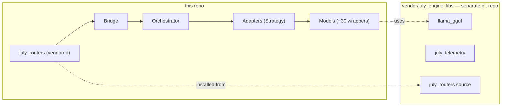

---
tags:
  - Overview
---

# July Engine

**July Engine** (`july_engine`) is the local inference core of the "Jully" ecosystem: a FastAPI multimodal engine serving chat (OpenAI/Anthropic-compatible), vision, TTS/STT, image generation/editing, entity extraction, and RAG — entirely with local models (GGUF via `llama-cpp-python`, PyTorch/Transformers, Diffusers, Coqui/Kokoro/Piper TTS, DeepFace/OpenCV). It auto-manages VRAM/RAM: loading models, keeping them warm between requests, LRU-evicting under pressure, and decrementing GPU layers as a last resort.

External web/code search used to live in this repo but moved to a separate **July Search** service — July Engine no longer calls external LLM APIs in its normal request path.

## What makes it different

- **Automatic VRAM/RAM management** — no manual "how many models fit on my GPU" tuning. The engine estimates required VRAM before loading, evicts the least-recently-used idle model when needed, and progressively reduces GPU layers before ever refusing a request. See [Orchestrator & VRAM Management](architecture/orchestrator.md).
- **Sequence pooling** — one loaded GGUF instance serves N parallel requests via `n_seq_max`, at the cost of extra KV cache only — not a full extra model copy.
- **OpenAI & Anthropic compatible** — point any existing client at `/v1/openai/*` or `/v1/anthropic/*` and it works against whatever local GGUF model you've configured.
- **~30 local model wrappers**, one per file, covering chat, vision, embeddings, entity extraction, TTS, STT, image editing/generation, upscaling/restoration, and video generation — see [Models](models/index.md).

## Where to start

- **New to the codebase?** Start with [Getting Started](getting-started.md) (setup, running, testing) then [Architecture Overview](architecture/overview.md).
- **Configuring a model?** Use the [Admin Panel](configuration/admin-panel.md), or read the [Resource Calculator](configuration/resource-calculator.md) docs to understand the VRAM estimate.
- **Looking for a specific model?** Jump straight to [Models](models/index.md) — every wrapper has its own page, including honest notes on the handful that are currently broken.
- **Wiring a new endpoint?** [API Reference](api-reference.md) lists everything currently exposed, and flags what's implemented-but-unreachable.
- **Auditing dependencies?** See [Known Issues](known-issues.md) for dead code paths, and [Licensing](licensing.md) for third-party license obligations beyond this repo's own MIT license.

## Repository layout at a glance

MIT-licensed (`LICENSE`), but several vendored/optional dependencies carry more restrictive licenses — see [Licensing](licensing.md) before commercial or network-service use.
